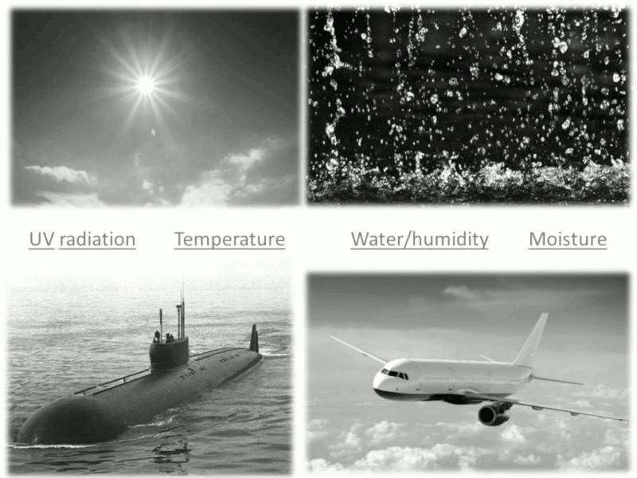

I currently work at the [Impact Engineering Laboratory](http://iel.eng.ox.ac.uk/), [Solid Mechanics and Materials Engineering](http://www2.eng.ox.ac.uk/solidmech/), [Department of Engineering Science](https://www.eng.ox.ac.uk/), [University of Oxford](http://www.ox.ac.uk/).
My current project aims to understand the influence of humidity and temperature upon the mechanical performance of carbon fibre composites. You are invited to look at my [research papers](/research#publications) for more details of my work.

## Strain rate dependency of materials

The mechanical response of materials  can be affected by how fast the loads are applied, how quick deformation occurs. For instance, polymers tend to be stronger at higher speeds of deformation than at quasi-static regime due to their viscoelastic nature. In my research, I investigate how different materials behave at quasi-static and at  dynamic regimes. This information is later translated into mechanical models to help engineers to design real components.

## Ageing of composite materials
My research is oriented to the study of composite materials for underwater and aerospace applications. During service conditions these composites will be subjected to humid environments. My current investigation aims to develop a constitutive model able to capture the effects of water uptake upon the strain rate dependent properties of composites. Previously, in my master thesis, I investigated the degradation of fracture toughness of an epoxy resin due to hygrothermal aging.

## Development of novel experimental techniques
I like to be challenged by complex experimental setups. I have designed my own equipment (thermal chambers for in-situ testing) and experimental setups for micromechanical tests (micro compresion, tension and compact tension rigs).

## Other research interests
- Constitutive modelling
- Instrumentation (LabView, sensors, Arduino)

## Publications
[G. Quino*, Y. Chen, K. R. Ramakrishnan, F. Martínez-Hergueta, G. Zumpano, A. Pellegrino, N. Petrinic, Speckle patterns for DIC in challenging scenarios: rapid application and impact endurance,” Meas. Sci. Technol., Jul. 2020.](https://iopscience.iop.org/article/10.1088/1361-6501/abaae8)

[G. Quino, A. Pellegrino, V. L. Tagarielli*, N. Petrinic, “Effects of water absorption on the mechanical properties of GFRPs,” Compos. Sci. Technol., p. 108316, Jun. 2020.](https://www.sciencedirect.com/science/article/pii/S0266353819333536)

[D. Thomson*, G. Quino, H. Cui, A. Pellegrino, B. Erice, and N. Petrinic, “Strain-rate and off-axis loading effects on the fibre compression strength of CFRP laminates: Experiments and constitutive modelling,” Compos. Sci. Technol., vol. 195, p. 108210, Jul. 2020.](https://www.sciencedirect.com/science/article/pii/S0266353819325631)

[G. Quino*, F. De Cola, K. Dragnevski, and N. Petrinic, “Exploring the application of sound measurements to assess the structural integrity of fibre bundles,” Proc. Struc. Integr., vol. 18, pp. 507-515, Sep. 2019.](https://www.sciencedirect.com/science/article/pii/S2452321619304044)

[F. De Cola, G. Quino*, K. Dragnevski, and N. Petrinic, “An extended in-situ method to improve the understanding of fracture mechanics of granular materials using sound measurements,” Eur. J. Mech. - A/Solids, vol. 76, pp. 1-12, Jul. 2019.](https://www.sciencedirect.com/science/article/pii/S0997753818302213)

[G. Quino, A. Pellegrino, V. L. Tagarielli*, N. Petrinic, “Measurements of the effects of pure and salt water absorption on the rate-dependent response of an epoxy matrix,” Comp. Part B., vol. 146, pp. 213–221, Aug. 2018.](https://www.sciencedirect.com/science/article/pii/S1359836817342737)

[G. Quino, J. El Yagoubi, and G. Lubineau*, “Characterizing the toughness of an epoxy resin after wet aging using compact tension specimens with non-uniform moisture content,” Polym. Degrad. Stab., vol. 109, pp. 319– 326, Aug. 2014.](https://www.sciencedirect.com/science/article/pii/S014139101400295X)

## Conferences

**G. Quino**, A. Pellegrino, N. Petrinic. "Composites in extreme environments: Effects of high strain rate, humidity and temperature", in International Conference on Defence Technology, 26-29 October 2020. Nanjing, China.

**G. Quino**, V. L. Tagarielli, and N. Petrinic, “Towards a strain rate and water ageing sensitive constitutive modelling: Effects of strain rate and water uptake upon the properties of E-glass fibre reinforced epoxy,” in 5th International Conference on Mechanics of Composites, Lisbon, 2019.

**G. Quino**, V. L. Tagarielli, and N. Petrinic, “Water ageing effects upon the mechanical properties of E-glass fibre reinforced epoxy and its constituents,” in Engineering Mechanics Institute Conference, Pasadena, 2019.

**G. Quino**, F. De Cola, V. L. Tagarielli, and N. Petrinic, “Exploring the application of sound measurements to assess the structural integrity of fibre bundles,” in 25th International Conference - Fracture and Structural Integrity, Catania, 2019.

D. M. Thomson, **G. Quino**, H. Cui, B. Erice and N. Petrinic. "A study on fibre kinking criteria for unidirectional CFRPs under off-axis compression at quasi-static and dynamic loads", in UKACM Conference, London, 2019.

**G. Quino**, V. L. Tagarielli, and N. Petrinic, “Glass fibre bundles in extreme environments: high strain rates and water exposure,” in 55th Annual Technical Meeting of the Society of Engineering Science, Madrid, 2018.

**G. Quino**, F. De Cola, K. Dragnevski, and N. Petrinic, “In-situ testing of sand grains and sound measurements,” in II Sinapsis, Berlin, 2017.

**G. Quino**, F. De Cola, K. Dragnevski, and N. Petrinic, “Quartz grain mechanics: in-situ testing and sound measurements,” in Microscience Microscopy Congress, Manchester, 2017.

**G. Quino**, V. L. Tagarielli, and N. Petrinic, “Degradation of composite materials under extreme conditions,” in I Sinapsis, Paris, 2016.

**G. Quino**, V. L. Tagarielli, and N. Petrinic, “Effects of strain rate and water ageing upon the properties of epoxy resin matrix for composites,” in ICCS18, Lisbon, 2015.
